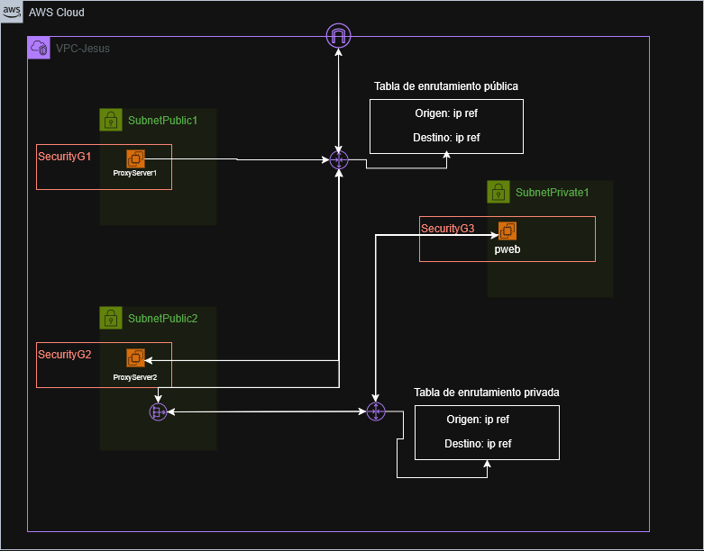
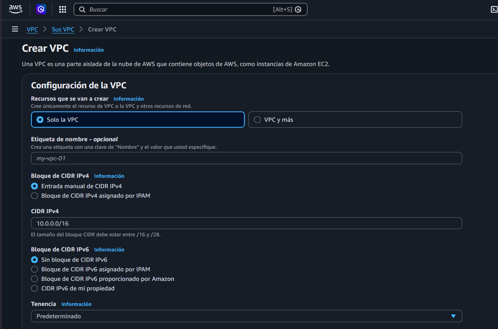
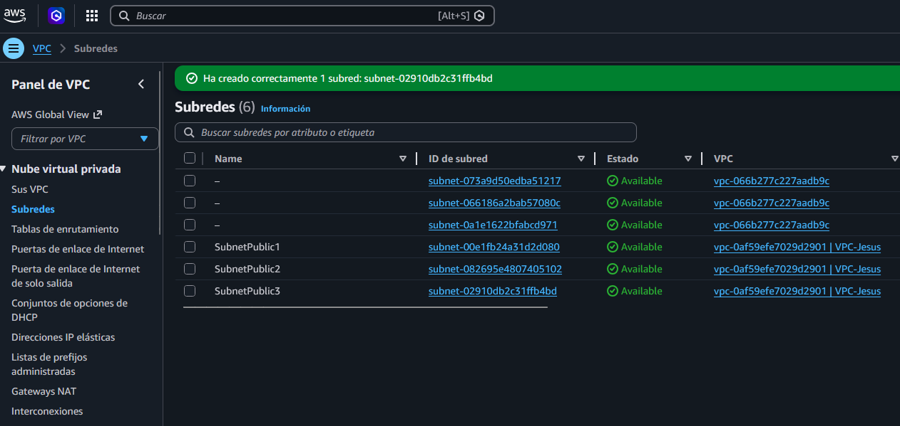

# Arquitectura de Red Segura en AWS

## Contexto del Proyecto
Este proyecto consiste en el diseño e implementación de una infraestructura de red empresarial dentro de Amazon Web Services (AWS). El despliegue se centra en la creación de una Virtual Private Cloud (VPC) estructurada en tres capas, permitiendo una separación lógica y física entre los puntos de entrada públicos y los recursos críticos de procesamiento de datos.

La necesidad surge de la arquitectura de aplicaciones web modernas, donde exponer directamente un servidor de aplicaciones a internet representa un riesgo de seguridad elevado. Mediante esta segmentación, se establece un perímetro controlado donde solo los servidores proxy autorizados pueden comunicarse con la capa interna de la aplicación.

## Justificación y Beneficios
La implementación de esta arquitectura responde a los siguientes criterios técnicos:

* **Reducción de la superficie de ataque**: Al ubicar el servidor de aplicaciones en una subred privada, se eliminan los vectores de ataque directos desde el exterior, ya que el recurso carece de una dirección IP pública.
* **Control de tráfico de salida**: El uso de un NAT Gateway permite que los recursos internos realicen peticiones hacia internet (como actualizaciones de seguridad) sin permitir que actores externos inicien conexiones no solicitadas hacia la red privada.
* **Seguridad basada en identidad**: El filtrado de red se gestiona a través de Security Groups que referencian otros grupos de seguridad en lugar de direcciones IP estáticas. Esto permite una red dinámica y escalable donde la confianza se basa en el rol del recurso y no en su ubicación lógica.
* **Administración segura**: El acceso a la infraestructura para tareas de mantenimiento se realiza mediante métodos que no exponen puertos críticos al tráfico global, utilizando un host bastión o servicios de gestión nativos de AWS.

## Diagrama de Arquitectura
El siguiente esquema detalla el flujo de datos, la segmentación de subredes y la ubicación de los componentes de red dentro de la VPC.

# Fase 1: Detalles de configuración de la VPC

Para la creación del contenedor de red, los parámetros seleccionados en la consola se definen de la siguiente manera:

### Recursos que se van a crear
**Solo la VPC**: Esta opción indica que AWS creará únicamente el límite lógico de la red. No se generarán subredes, gateways ni tablas de enrutamiento de forma automática, permitiendo una construcción manual y personalizada de cada componente.

### Etiqueta de nombre
**VPC-Jesus**: Es el identificador asignado al recurso mediante etiquetas (Tags). Este nombre permite organizar y filtrar la red dentro del panel de administración de AWS.

### Bloque de CIDR IPv4
**Entrada manual**: Permite definir específicamente el rango de direcciones IP privadas que tendrá la red.
**10.0.0.0/16**: Este valor determina el tamaño de la red.
**Observación**: Un bloque /24 permite un total de 256 direcciones IP. AWS reserva siempre 5 direcciones para gestión interna, dejando 251 disponibles. Si se planea seguir fielmente el diagrama de arquitectura con múltiples subredes, un bloque /16 (65,536 direcciones) ofrecería mayor flexibilidad para la segmentación.

### Bloque de CIDR IPv6
**Sin bloque de CIDR IPv6**: Se ha optado por no asignar direccionamiento IPv6. En entornos de infraestructura como servicio (IaaS) destinados a pruebas, trabajar exclusivamente con IPv4 simplifica la configuración de las reglas de filtrado de los Security Groups.

### Tenencia
**Predeterminado**: Indica que la VPC y las instancias que se lancen en ella se ejecutarán sobre hardware compartido con otros usuarios de AWS. Es la opción estándar y de menor costo.

### Control de cifrado de VPC
**Ninguno**: No se aplica una capa de cifrado de red adicional gestionada por AWS para el tráfico entre instancias. Esto evita costos operativos y de procesamiento innecesarios para un entorno de laboratorio.

# Fase 2: Creación y segmentación de Subredes

Una vez establecida la VPC, el siguiente paso es la división del espacio de direccionamiento en subredes lógicas para separar los componentes de la infraestructura según su función y nivel de exposición.

### Configuración de Subredes
Se han definido tres subredes bajo el bloque CIDR 10.0.0.0/16 siguiendo un esquema de direccionamiento /24:

1. **SubnetPublic1**:
    * **Bloque CIDR**: 10.0.1.0/24
    * **Zona de disponibilidad**: us-east-2a
    * **Función**: Segmento público destinado al primer ProxyServer.

2. **SubnetPublic2**:
    * **Bloque CIDR**: 10.0.2.0/24
    * **Zona de disponibilidad**: us-east-2a
    * **Función**: Segmento público destinado al segundo servidor de entrada (ProxyServer2)

3. **SubnetPrivate1**:
    * **Bloque CIDR**: 10.0.3.0/24
    * **Zona de disponibilidad**: us-east-2a
    * **Función**: Zona aislada para el servidor de aplicaciones (pweb), restringiendo el acceso directo desde internet.

### Pasos en consola
1. Acceder a la sección de **Subnets** dentro del panel de Amazon VPC.
2. Seleccionar **Create subnet** y asociar los recursos a la VPC-Jesús.
3. Definir los nombres, zonas de disponibilidad y bloques CIDR correspondientes para cada uno de los tres segmentos.
4. Configurar la etiqueta Name para facilitar la identificación administrativa de cada subred.
5. Finalizar el proceso seleccionando **Create subnet**.

### Evidencia de Configuración

