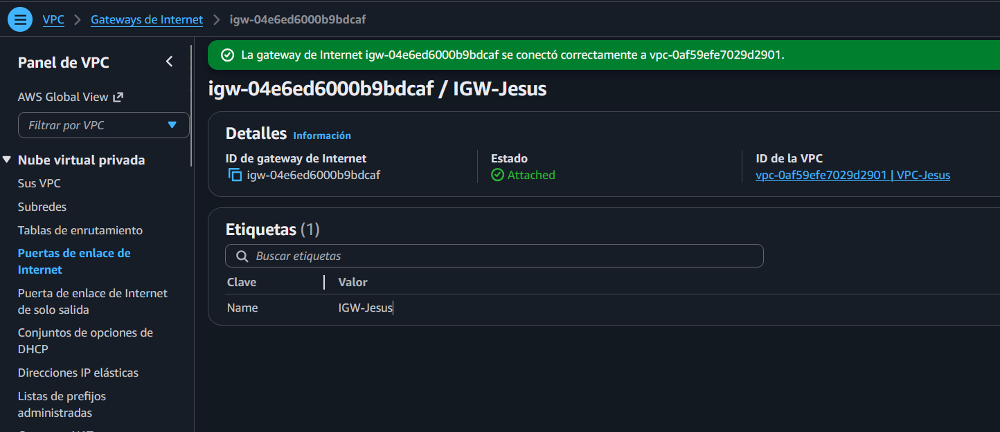
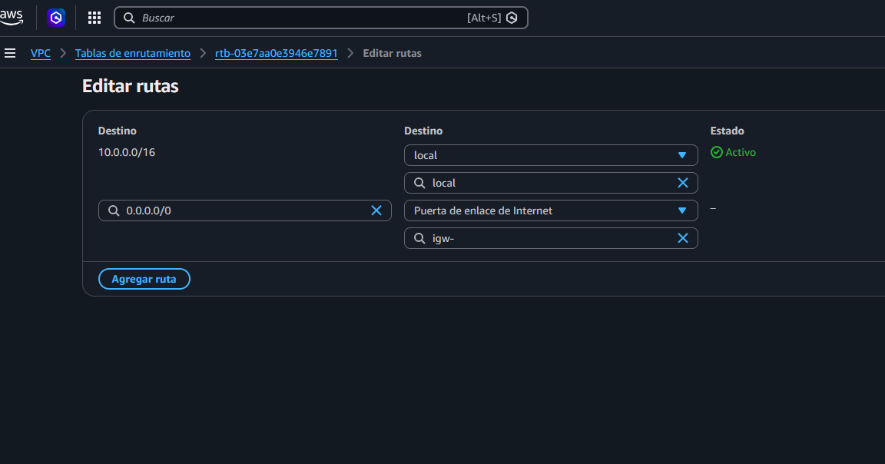
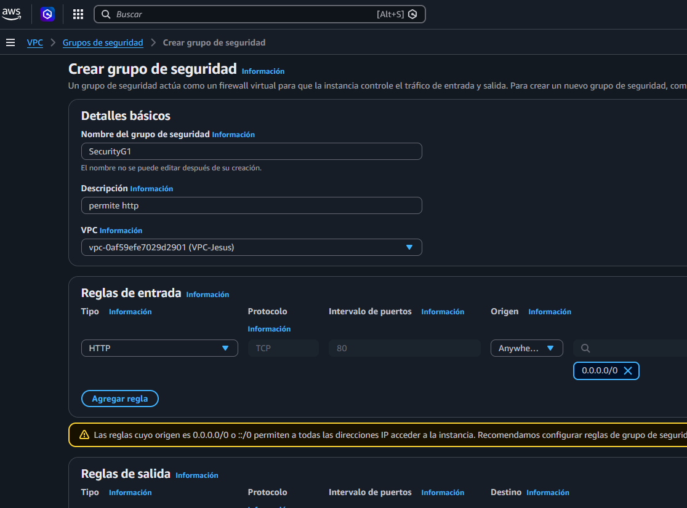
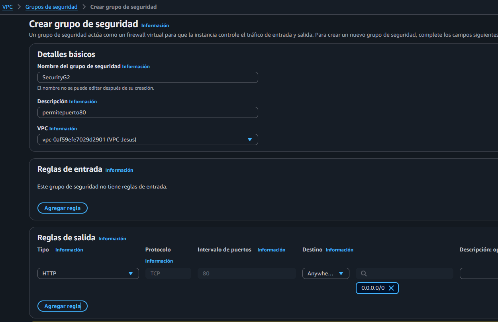
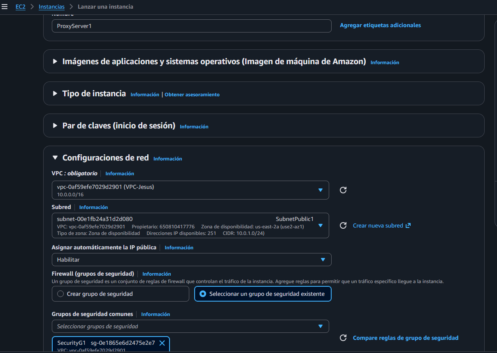
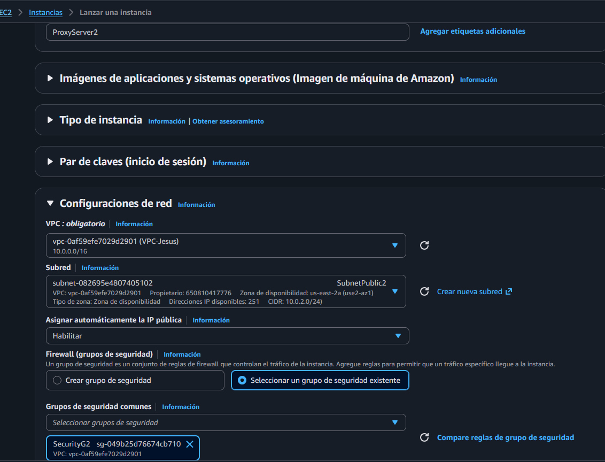
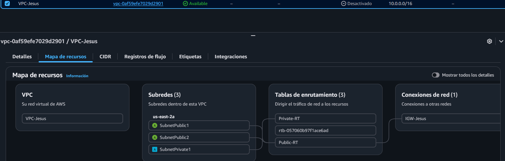
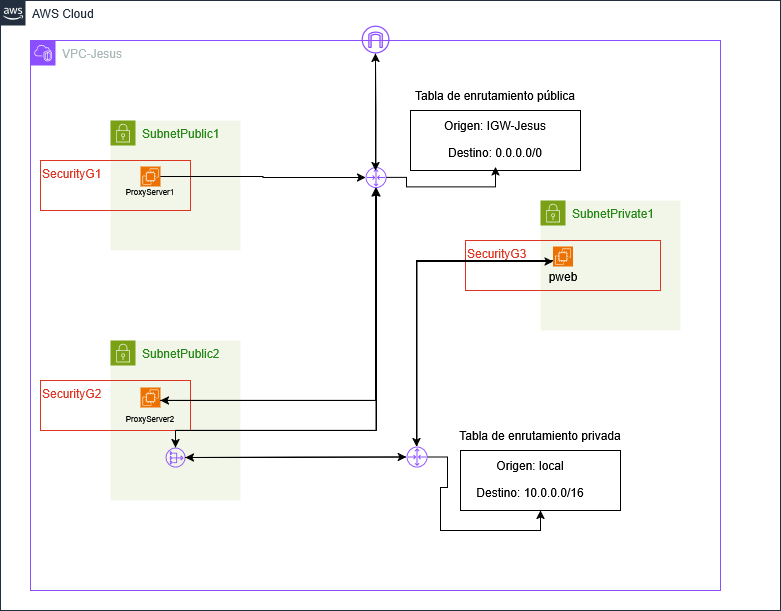

# Arquitectura de Red Segura en AWS

## Contexto del Proyecto
Este proyecto consiste en el diseño e implementación de una infraestructura de red empresarial dentro de Amazon Web Services (AWS). El despliegue se centra en la creación de una Virtual Private Cloud (VPC) estructurada en tres capas, permitiendo una separación lógica y física entre los puntos de entrada públicos y los recursos críticos de procesamiento de datos.

La necesidad surge de la arquitectura de aplicaciones web modernas, donde exponer directamente un servidor de aplicaciones a internet representa un riesgo de seguridad elevado. Mediante esta segmentación, se establece un perímetro controlado donde solo los servidores proxy autorizados pueden comunicarse con la capa interna de la aplicación.

## Justificación y Beneficios
La implementación de esta arquitectura responde a los siguientes criterios técnicos:

* **Reducción de la superficie de ataque**: Al ubicar el servidor de aplicaciones en una subred privada, se eliminan los vectores de ataque directos desde el exterior, ya que el recurso carece de una dirección IP pública.
* **Control de tráfico de salida**: El uso de un NAT Gateway permite que los recursos internos realicen peticiones hacia internet (como actualizaciones de seguridad) sin permitir que actores externos inicien conexiones no solicitadas hacia la red privada.
* **Seguridad basada en identidad**: El filtrado de red se gestiona a través de Security Groups que referencian otros grupos de seguridad en lugar de direcciones IP estáticas. Esto permite una red dinámica y escalable donde la confianza se basa en el rol del recurso y no en su ubicación lógica.
* **Administración segura**: El acceso a la infraestructura para tareas de mantenimiento se realiza mediante métodos que no exponen puertos críticos al tráfico global, utilizando un host bastión o servicios de gestión nativos de AWS.

## Diagrama de Arquitectura
El siguiente esquema detalla el flujo de datos, la segmentación de subredes y la ubicación de los componentes de red dentro de la VPC.

# Fase 1: Detalles de configuración de la VPC

Para la creación del contenedor de red, los parámetros seleccionados en la consola se definen de la siguiente manera:

### Recursos que se van a crear
**Solo la VPC**: Esta opción indica que AWS creará únicamente el límite lógico de la red. No se generarán subredes, gateways ni tablas de enrutamiento de forma automática, permitiendo una construcción manual y personalizada de cada componente.

### Etiqueta de nombre
**VPC-Jesus**: Es el identificador asignado al recurso mediante etiquetas (Tags). Este nombre permite organizar y filtrar la red dentro del panel de administración de AWS.

### Bloque de CIDR IPv4
**Entrada manual**: Permite definir específicamente el rango de direcciones IP privadas que tendrá la red.
**10.0.0.0/16**: Este valor determina el tamaño de la red.
**Observación**: Un bloque /24 permite un total de 256 direcciones IP. AWS reserva siempre 5 direcciones para gestión interna, dejando 251 disponibles. Si se planea seguir fielmente el diagrama de arquitectura con múltiples subredes, un bloque /16 (65,536 direcciones) ofrecería mayor flexibilidad para la segmentación.

### Bloque de CIDR IPv6
**Sin bloque de CIDR IPv6**: Se ha optado por no asignar direccionamiento IPv6. En entornos de infraestructura como servicio (IaaS) destinados a pruebas, trabajar exclusivamente con IPv4 simplifica la configuración de las reglas de filtrado de los Security Groups.

### Tenencia
**Predeterminado**: Indica que la VPC y las instancias que se lancen en ella se ejecutarán sobre hardware compartido con otros usuarios de AWS. Es la opción estándar y de menor costo.

### Control de cifrado de VPC
**Ninguno**: No se aplica una capa de cifrado de red adicional gestionada por AWS para el tráfico entre instancias. Esto evita costos operativos y de procesamiento innecesarios para un entorno de laboratorio.

# Fase 2: Creación y segmentación de Subredes

Una vez establecida la VPC, el siguiente paso es la división del espacio de direccionamiento en subredes lógicas para separar los componentes de la infraestructura según su función y nivel de exposición.

### Configuración de Subredes
Se han definido tres subredes bajo el bloque CIDR 10.0.0.0/16 siguiendo un esquema de direccionamiento /24:

1. **SubnetPublic1**:
    * **Bloque CIDR**: 10.0.1.0/24
    * **Zona de disponibilidad**: us-east-2a
    * **Función**: Segmento público destinado al primer ProxyServer.

2. **SubnetPublic2**:
    * **Bloque CIDR**: 10.0.2.0/24
    * **Zona de disponibilidad**: us-east-2a
    * **Función**: Segmento público destinado al segundo servidor de entrada (ProxyServer2)

3. **SubnetPrivate1**:
    * **Bloque CIDR**: 10.0.3.0/24
    * **Zona de disponibilidad**: us-east-2a
    * **Función**: Zona aislada para el servidor de aplicaciones (pweb), restringiendo el acceso directo desde internet.

### Pasos en consola
1. Acceder a la sección de **Subnets** dentro del panel de Amazon VPC.
2. Seleccionar **Create subnet** y asociar los recursos a la VPC-Jesús.
3. Definir los nombres, zonas de disponibilidad y bloques CIDR correspondientes para cada uno de los tres segmentos.
4. Configurar la etiqueta Name para facilitar la identificación administrativa de cada subred.
5. Finalizar el proceso seleccionando **Create subnet**.

### Evidencia de Configuración

# Fase 3: Conectividad y Enrutamiento

En esta etapa se configura el punto de salida a internet y se definen las reglas de navegación para que las subredes públicas puedan comunicarse con el exterior.

### 1. Internet Gateway (IGW)
El Internet Gateway es el componente de VPC que permite la comunicación entre los recursos dentro de la red privada e internet.
* **Nombre**: `IGW-Jesus`
* **Acción**: Creación del recurso y asociación (Attach) a la `VPC-Jesús`.

### 2. Tablas de Enrutamiento (Route Tables)
Se han creado tablas diferenciadas para gestionar el tráfico según el nivel de exposición de las subredes:

#### Tabla Pública (Public-RT)
Asociada a `SubnetPublic1` y `SubnetPublic2`.
* **Ruta Local**: `10.0.0.0/16` -> `local` (Tráfico interno de la VPC).
* **Ruta de Internet**: `0.0.0.0/0` -> `IGW-Jesus` (Todo el tráfico externo se dirige al Gateway).

#### Tabla Privada (Private-RT)
Asociada a `SubnetPrivate1`.
* **Ruta Local**: `10.0.0.0/16` -> `local`.
* **Nota**: Por diseño, esta tabla no cuenta con una ruta directa hacia el Internet Gateway, manteniendo el aislamiento del servidor de aplicaciones.

### Paso 3: Configurar la Ruta de Internet (Solo para la Pública)

En este punto es donde se establece la diferencia técnica y lógica entre los segmentos públicos y privados de la arquitectura.

1. **Selección de Tabla**: Se debe identificar y seleccionar la tabla **Public-RT** en el panel de administración de VPC.
2. **Acceso a Rutas**: En el panel inferior, navegar a la pestaña **Routes** y seleccionar el botón **Edit routes**.
3. **Definición de Salida**: Seleccionar **Add route** e ingresar el valor **0.0.0.0/0** en el campo *Destination*. Este parámetro representa cualquier dirección IP que no pertenezca a la red local.
4. **Asignación de Target**: En la columna *Target*, seleccionar la opción **Internet Gateway** y elegir el recurso **IGW-Jesus**.
5. **Persistencia**: Seleccionar **Save changes** para activar la conectividad externa en las subredes asociadas.

> **Dato técnico**: La tabla **Private-RT** no requiere este paso. Al mantener únicamente la ruta `local` ($10.0.0.0/16$), se garantiza que el tráfico de esa subred permanezca dentro de la VPC, protegiendo al servidor de aplicaciones contra accesos no autorizados desde el exterior.

# Fase 4: Seguridad y Control de Acceso (Security Groups)

En esta fase se implementa la capa de seguridad perimetral y de host mediante el uso de **Security Groups**. Estos actúan como firewalls con estado (*stateful*) a nivel de instancia, permitiendo filtrar el tráfico entrante y saliente según reglas específicas de protocolos y puertos.

### Estrategia de Micro-segmentación
Se han definido tres grupos de seguridad independientes para aplicar políticas de acceso granulares en cada nodo de la red:

#### 1. SecurityG1 (ProxyServer1)
Protege el primer punto de entrada en la zona `us-east-2a`.
* **Inbound Rules**: 
    * HTTP (80) desde `0.0.0.0/0`.

#### 2. SecurityG2 (ProxyServer2)
Protege el segundo punto de entrada en la zona `us-east-2b`.
* **Inbound Rules**: 
    * HTTP (80) desde `0.0.0.0/0`.
    

#### 3. SecurityG3 (pweb / AppServer)
El "Guardia del Búnker". Es el grupo más crítico, ya que aplica el encadenamiento de seguridad.
* **Inbound Rules**:
    * **TCP (80/8080)**: El origen (*Source*) son los IDs de **SecurityG1** y **SecurityG2**. Esto garantiza que la aplicación solo responda a peticiones legítimas provenientes de los proxies.

# Fase 5: Despliegue de Instancias EC2

En esta etapa se procede al lanzamiento de las instancias de cómputo que materializan la arquitectura. Se han configurado tres servidores bajo el modelo de responsabilidad compartida, asegurando que cada uno cumpla un rol específico en la topología de red.

## 1. Nivel Público (Entry Points)
Se han desplegado dos servidores en las subredes públicas para actuar como proxies y garantizar la disponibilidad del servicio.

### ProxyServer1
* **Subred**: `SubnetPublic1` (Zona `us-east-2a`).
* **Auto-assign Public IP**: **Enabled**. Necesario para permitir el tráfico HTTP desde internet.
* **Security Group**: `SecurityG1` (Permite puerto 80).

### ProxyServer2
* **Subred**: `SubnetPublic2` (Zona `us-east-2a`).
* **Auto-assign Public IP**: **Enabled**. Proporciona redundancia al sistema.
* **Security Group**: `SecurityG2` (Espejo de G1).

---

## 2. Nivel Privado (Backend Búnker)
El núcleo de la aplicación se encuentra en un entorno estrictamente aislado.

### pweb (AppServer)
* **Subred**: `SubnetPrivate1` (Zona `us-east-2a`).
* **Auto-assign Public IP**: **Disabled**. Por diseño de seguridad, este servidor no tiene visibilidad directa desde internet, mitigando ataques de fuerza bruta o escaneos externos.
* **Security Group**: `SecurityG3`. Solo permite tráfico entrante si el origen son los IDs de `SecurityG1` o `SecurityG2`.

---

Para verificar el mapa: 

por último la arquitectura nos quedaría de la siguiente forma: 

# Conclusiones y Beneficios de la Arquitectura

El despliegue de la infraestructura **VPC-Jesus** en la región de Ohio representa una solución robusta basada en el modelo de capas, priorizando la seguridad del dato y la resiliencia del servicio.

### Conclusión Técnica
Se ha logrado implementar con éxito un entorno de red segmentado donde la lógica de negocio (`pweb`) se encuentra totalmente aislada de vectores de ataque externos. La integración de tablas de enrutamiento específicas y firewalls con estado (Security Groups) garantiza que el flujo de tráfico sea legítimo y controlado en todo momento.

### Beneficios Implementados

* **Seguridad Perimetral (Aislamiento)**: El uso de subredes privadas para el backend (`pweb`) asegura que el servidor de aplicaciones sea invisible para escaneos de red públicos, reduciendo drásticamente la superficie de ataque.
* **Micro-segmentación (SG Chaining)**: Al configurar el `SecurityG3` para aceptar tráfico únicamente desde los IDs de `SecurityG1` y `SecurityG2`, se aplica una capa de seguridad donde solo los proxies autorizados pueden comunicarse con la app.
* **Alta Disponibilidad (Multi-AZ)**: La distribución de los puntos de entrada (`ProxyServer1` y `ProxyServer2`) en diferentes zonas de disponibilidad asegura la continuidad del negocio ante posibles fallos de infraestructura en un centro de datos específico.
* **Optimización de Costos**: La arquitectura se apoya enteramente en recursos de la **Capa Gratuita de AWS** (`t2.micro`), demostrando que es posible diseñar entornos seguros y escalables sin incurrir en costos operativos iniciales.
* **Escalabilidad Horizontal**: El diseño permite añadir n-cantidad de servidores adicionales en las subredes existentes sin necesidad de reconfigurar la topología de red base.

---
**Proyecto finalizado por: Jesús Angel Chávez Huamán**

